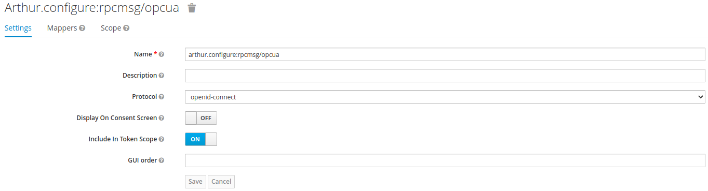

# Authorization in ICE Lab Data Collection Architecture

Questo progetto è uno stub esplorativo della configurazione di un sistema di autorizzazione basato su OAuth2 nell'ambito dell'architettura di raccolta dati dell'ICE Lab.

## Panoramica

Una sorgente dati si interfaccia con un client OPC-UA, che deve ricevere dei messaggi (comandi) da un controller; questi messaggi transitano per un broker di messaggi, [RabbitMQ](https://www.rabbitmq.com/).

```text
                                                         ----------
 ----------------         ----------------              | RabbitMQ |             -----------------------
| HW Data Source | <---> |  OPC UA Client | <---cmds--- |   Msg    | <---cmds---| Automation Controller |
 ----------------         ----------------              |  Broker  |             -----------------------
                                                         ----------
```

Il sistema di autorizzazione si inserisce fra broker e controller e permette di verificare che i messaggi che giungono a un client OPC-UA dispongano dei necessari permessi.

Trattandosi di una comunicazione machine-to-machine (M2M), si è scelto d'implementare il flusso [client credentials](https://auth0.com/docs/authorization/flows/client-credentials-flow), dove:

- Il sistema è del tutto trasparente dal punto di vista del PC UA Client.
- Il resource server è il broker RabbitMQ;
- Le risorse sono gli exchange su cui vengono indirizzati i messaggi;
- Il client è l'automation controller;
- L'authorization server è un'istanza di [Keycloak](https://www.keycloak.org/) che persiste i dati in un database [PostgreSQL](https://www.postgresql.org/).

### OAuth2 in RabbitMQ

Il supporto per OAuth2 in RabbitMQ viene dato da un [plug-in](https://github.com/rabbitmq/rabbitmq-server/tree/master/deps/rabbitmq_auth_backend_oauth2).

Messaggi provenienti da un publisher sono indirizzati su exchange facenti parte di un virtual host (VHost), che a loro volta accodano i messaggi su una o più code, su cui sono in ascolto dei consumer.

Per poter indirizzare un messaggio su un determinato exchange, un publisher deve presentare a RabbitMQ un token contenente uno scope costruito nel modo seguente:

```text
RESOURCE_SERVER_ID.<permission>:<vhost_pattern>/<name_pattern>
```

Dove:

- ```<permission>``` definisce il tipo di accesso (```configure```, ```read```, o ```write```);
- ```<vhost_pattern>``` è una pattern per i VHost a cui il token da accesso;
- ```<name_pattern>``` è una pattern per gli exchange a cui il token da accesso;
- ```RESOURCE_SERVER_ID``` da modo di suddividere logicamente gli scope in maniera ortogonale alla suddivisone per VHost.

Il token contente gli scope è un JWT firmato con chiave asimmetrica. Per verificare la firma, RabbitMQ può ottenere il JWK set direttamente dalla REST API di Keycloak.

L'API di RabbitMQ non è nativamente pensata con il supporto per OAuth2, pertanto il token viene passato dal publisher a RabbitMQ al momento di apertura della connessione, tramite il campo solitamente riservato alla password utente (il nome utente viene ignorato).

RabbitMQ verifica il time to live del token per determinare se esso sia scaduto, sia al momento di apertura della connessione, _sia al momento della pubblicazione di un messaggio_.

### Cosa fa

- __Graal__: Applicativo Java di test che fa le veci del OPC UA Client. Si autentica su RabbitMQ usando delle credenziali utente. Dichiara un exchange con nome e ci fa il bind di una coda. Rimane in ascolto sulla coda per l'arrivo di eventuali messaggi, che riporta su stdout.
- __Whitebunny__: Applicativo Java di test che fa le veci del Automation Controller. Contatta Keycloak per ottenere un access token, che usa per stabilire una connessione all'exchange creato da Graal e pubblicarci un messaggio.
- __RabbitMQ__: Quando riceve una richiesta di connessione, prima prova a verificare la presenza di un access token nel campo password; come fallback, tenta di eseguire l'autenticazione con credenziali utente. Se riconosce un access token, contatta Keycloak per ottenere il JWK set e verificarlo.
- __Keycloak__: Stacca access token a Whitebunny ed espone un endpoint per il recupero del JWK set.

## Utilizzo su K8s

Sono richiesti [Git](https://git-scm.com/), [GNU Make](https://www.gnu.org/software/make/), [Maven](https://maven.apache.org/), [Docker](https://www.docker.com/), [Minikube](https://minikube.sigs.k8s.io/) e Java 11.

Dopo aver clonato il progetto, da terminale portarsi nella cartella contenente il Makefile e digitare i comandi:

```shell
make minikube
```

Una volta che si sarà aperta nel browser la dashboard di Minikube, in un'altra shell o tab aperta nella stessa cartella digitare:

```shell
make k8s-postgres
make k8s-keycloak
```

Il secondo comando richiederà di inserire la password dell'account di amministrazione di Keycloak, usato per accedere alla pannello di controllo.

A questo punto è possibile connettersi al pannelo di controllo di Keycloak all'url `http://keycloak.<minikubeIp>.nip.io/auth`. Per vedere l'url completo, digitare:

```shell
make view-k8s-keycloak
```

Per la configurazione di Keycloak, seguire [l'apposita sezione](#-Configurazione-di-Keycloak).

Digitare:

```shell
make k8s-rabbitmq
```

Verrà richiesto di inserire il nome del realm ed il resource server id scelti duranti la configurazione di Keycloak. Per la configurazione di Rabbitmq, seguire [la sezione dedicata](#-Configurazione-di-RabbitMQ), con l'eccezione che bisogna accedere al pod anzichè al container docker. Per farlo, digitare:

```shell
kubectl exec -n rabbitmq-system -it icerabbitmq-server-0 --  /bin/bash 
```

Infine, vanno configurati i due applicativi di test in Java.

Creare un file `.idca.properties` nella `HOME` dell'utente. In questo file, vanno riportate le seguenti properties in formato chiave = valore:

```plain
rabbitmq.host
rabbitmq.port
rabbitmq.vhost
rabbitmq.exchange
rabbitmq.user
rabbitmq.password
auth.realm
auth.client.id
auth.client.secret
auth.host
auth.port
```

Dove `rabbitmq.user` e `rabbitmq.password` sono le credenziali dell'utente creato nel passo precedente che ha accesso al vhost, non dell'utente amministrativo.

Per vedere quali sono gli indirizzi e le porte dei due servizi, `keycloak-service` e `icerabbitmq`, digitare:

```shell
make make view-k8s-keycloak 
make make view-k8s-rabbitmq 
```

Per entrambi, l'indirizzo ip è quello di Minikube, mentre le porte sono quelle che forwardano rispettivamente sulle porte interne 8080 e 5672. Quindi ad esempio:

```plain
$ make view-k8s-keycloak
Keycloak:                 http://keycloak.192.168.49.2.nip.io/auth

NAME                                       READY   STATUS    RESTARTS   AGE
pod/keycloak-deployment-6f55ffc57f-sps9g   1/1     Running   0          57m
pod/postgres-deployment-7c9947cbcd-sb958   1/1     Running   0          66m

NAME                       TYPE        CLUSTER-IP       EXTERNAL-IP   PORT(S)          AGE
service/keycloak-service   NodePort    10.99.1.252      <none>        8080:30946/TCP   57m
service/postgres-service   ClusterIP   10.109.204.109   <none>        5432/TCP         66m

NAME                                  READY   UP-TO-DATE   AVAILABLE   AGE
deployment.apps/keycloak-deployment   1/1     1            1           57m
deployment.apps/postgres-deployment   1/1     1            1           66m

NAME                                             DESIRED   CURRENT   READY   AGE
replicaset.apps/keycloak-deployment-6f55ffc57f   1         1         1       57m
replicaset.apps/postgres-deployment-7c9947cbcd   1         1         1       66m
```

Le properties sono `auth.host = 192.168.49.2` e `auth.port = 30946`.

```plain
$ make view-k8s-rabbitmq 
Username: default_user_VvlnjfMjHhMcJ9VuDx5
Password: TIYXagPmOWBNcY9f6XOO8PN06NxvQWNM
Rabbitmq: http://192.168.49.2:31725
Rabbitmq management: http://rabbitmq-management.192.168.49.2.nip.io

NAME                                             READY   STATUS    RESTARTS   AGE
pod/icerabbitmq-server-0                         1/1     Running   0          54m
pod/rabbitmq-cluster-operator-7cbf865f89-n56mq   1/1     Running   0          54m

NAME                        TYPE        CLUSTER-IP    EXTERNAL-IP   PORT(S)                                          AGE
service/icerabbitmq         NodePort    10.103.56.9   <none>        5672:31725/TCP,15672:30114/TCP,15692:31234/TCP   54m
service/icerabbitmq-nodes   ClusterIP   None          <none>        4369/TCP,25672/TCP                               54m

NAME                                        READY   UP-TO-DATE   AVAILABLE   AGE
deployment.apps/rabbitmq-cluster-operator   1/1     1            1           54m

NAME                                                   DESIRED   CURRENT   READY   AGE
replicaset.apps/rabbitmq-cluster-operator-7cbf865f89   1         1         1       54m

NAME                                  READY   AGE
statefulset.apps/icerabbitmq-server   1/1     54m

NAME                                       ALLREPLICASREADY   RECONCILESUCCESS   AGE
rabbitmqcluster.rabbitmq.com/icerabbitmq   True               True               54m
```

Le properties sono `rabbitmq.host = 192.168.49.2` e `rabbitmq.port = 31725`.

Poi digitare:

```shell
make build-all
java -jar graal/target/graal-1.0-SNAPSHOT.jar
```

In un'altra shell aperta nella stessa cartella:

```shell
java -jar whitebunny/target/whitebunny-1.0-SNAPSHOT.jar <message>
```

Il messaggio inviato sarà visibile nello stdout dove `graal` è in ascolto.

## Utilizzo in locale

Sono richiesti [Git](https://git-scm.com/), [GNU Make](https://www.gnu.org/software/make/), [Maven](https://maven.apache.org/), [Docker](https://www.docker.com/) e Java 11.

Dopo aver clonato il progetto, da terminale portarsi nella cartella contenente il Makefile e digitare i comandi:

```shell
make local-db
make local-keycloak
make local-rabbitmq
```

Se è il primo setup, bisogna configurare il [container Keycloak](#-Configurazione-di-Keycloak) ed il [container RabbitMQ](#-Configurazione-di-RabbitMQ).

Poi digitare:

```shell
make build-all
java -jar graal/target/graal-1.0-SNAPSHOT.jar <username> <password>
```

Dove `<username>` e `<password>` sono le credenziali per il client consumer.

Poi in un'altra shell aperta sulla stessa cartella:

```shell
java -jar whitebunny/target/whitebunny-1.0-SNAPSHOT.jar <clientSecret> [<message>]
```

Dove `<clientSecret>` è il secret del client publisher, e `<message>` è un argomento opzionale per specificare il testo del messaggio.

## Configurazione di Keycloak

La seguente configurazione di Keycloak va eseguita solamente la prima volta. Viene automaticamente persistita e riutilizzata in successivi restart dei container docker.

Tramite browser collegarsi al backoffice amministrativo di Keycloak su `http://172.17.0.1:8081/` e creare un nuovo realm di nome `dc`. Le credenziali di default per accedere al backoffice sono rispettivamente `admin`, `admin`.

Nella tab "Client Scopes", creare due nuovi scope:

```text
arthur.configure:rpcmsg/opcua
arthur.write:rpcmsg/opcua
```



Per ognuno, sotto la inner tab "Mappers", creare un nuovo mapper con le proprietà "name" `audience`, "mapper type" `Audience` e "Include Custom Audience" `arthur`.

Nella tab "Clients", creare un nuovo client con la seguente configurazione:


Fare click sul pulsante "Salva" in fondo.

Nella inner tab "Client Scopes", aggiungere agli "Assigned Default Client Scopes" gli scopes creati in precedenza.

Infine, nell'inner tab "Credentials" è riportato il secret per ottenere un access token per il client publisher.

## Configurazione di RabbitMQ

Anche la seguente configurazione di RabbitMQ va eseguita solamente la prima volta.

Digitare il comando:

```shell
docker exec -it rabbitmq-dev /bin/bash
```

Seguito da:

```shell
rabbitmqctl add_vhost "rpcmsg"
rabbitmqctl add_user <username> <password>
rabbitmqctl set_permissions -p "rpcmsg" <username> ".*" ".*" ".*"
exit
```

Dove `<username>` e `<password>` sono le credenziali per il client consumer.
