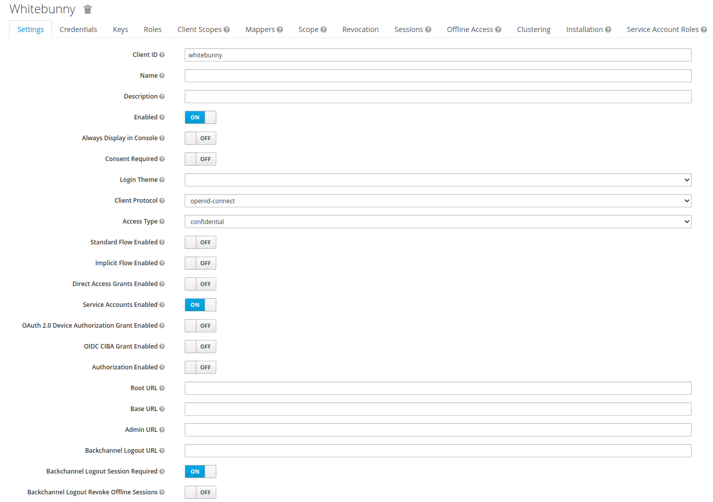

# Authorization in ICE Lab Data Collection Architecture

Questo progetto è uno stub esplorativo della configurazione di un sistema di autorizzazione basato su OAuth2 nell'ambito dell'architettura di raccolta dati dell'ICE Lab.

## Utilizzo

Sono richiesti [Git](https://git-scm.com/), [GNU Make](https://www.gnu.org/software/make/), [Maven](https://maven.apache.org/), [Docker](https://www.docker.com/) e Java 11.

Dopo aver clonato il progetto, per prima cosa va creato l'ambiente di test locale, partendo da authorization server.

Da terminale, portarsi nella cartella contenente il Makefile e digitare i comandi:
```shell
$ make local-db
$ make local-keycloak
```

La seguente configurazione di keycloak va eseguita __solamente la prima volta__. Viene automaticamente persistita e riutilizzata in successivi restart dei container docker.

Tramite browser collegarsi al backoffice amministrativo di Keycloak su `http://172.17.0.1:8081/` e creare un nuovo realm di nome `dc`. Le credenziali di default per accedere al backoffice sono rispettivamente `admin`, `admin`.

Nella tab "Client Scopes", creare due nuovi scope:

```text
arthur.configure:rpcmsg/opcua
arthur.write:rpcmsg/opcua
```


Per ognuno, sotto la inner tab "Mappers", creare un nuovo mapper con le proprietà "name" `audience`, "mapper type" `Audience` e "Include Custom Audience" `arthur`.

Nella tab "Clients", creare un nuovo client con la seguente configurazione:



e fare click sul pulsante "Salva" in fondo.

Nella inner tab "Client Scopes", aggiungere ai "Assigned Default Client Scopes" gli scopes creati in precedenza. Infine, nell'inner tab "Credentials" è riportato il client secret da usare in seguito per ottenere un access token.

Bisogna poi creare il broker di messaggi digitando il comando:

```shell
$ make local-rabbitmq
```

Anche la seguente configurazione di RabbitMQ va eseguita __solamente la prima volta__.

Digitare il comando:

```shell
$ docker exec -it rabbitmq-dev /bin/bash
```

Seguito da:

```shell
$ rabbitmqctl add_vhost "rpcmsg"
$ rabbitmqctl add_user <username> <password>
$ rabbitmqctl set_permissions -p "rpcmsg" <username> ".*" ".*" ".*"
$ exit
```

A questo punto la configurazione dell'ambiente è completa a eccezione per i due client di RabbitMQ:

Digitare il comandi:
```shell
$ make build-all
$ java -jar graal/target/graal-1.0-SNAPSHOT.jar <username> <password>
```

Dove `<username>` e `<password>` sono le credenziali digitate in precedenza nella configurazione di RabbitMQ.

Poi in un'altra shell aperta sulla stessa cartella:

```shell
$ java -jar whitebunny/target/whitebunny-1.0-SNAPSHOT.jar <clientSecret> [<message>]
```

Dove `<clientSecret>` è il secret generato in precedenza e verificato da Keycloak durante l'autenticazione del client OAuth, e `<message>` è un argomento opzionale per specificare il testo del messaggio.

## Panoramica

Una sorgente dati si interfaccia con un client OPC-UA, che deve ricevere dei messaggi (comandi) da un controller; questi messaggi transitano per un broker di messaggi, [RabbitMQ](https://www.rabbitmq.com/).

```text
                                                         ----------
 ----------------         ----------------              | RabbitMQ |             -----------------------
| HW Data Source | <---> |  OPC UA Client | <---cmds--- |   Msg    | <---cmds---| Automation Controller |
 ----------------         ----------------              |  Broker  |             -----------------------
                                                         ----------
```

Il sistema di autorizzazione si inserisce fra broker e controller e permette di verificare che i messaggi che giungono a un client OPC-UA dispongano dei necessari permessi.

Trattandosi di una comunicazione machine-to-machine (M2M), si è scelto d'implementare il flusso [client credentials](https://auth0.com/docs/authorization/flows/client-credentials-flow), dove:

- Il sistema è del tutto trasparente dal punto di vista del PC UA Client.
- Il resource server è il broker RabbitMQ;
- Le risorse sono gli exchange su cui vengono indirizzati i messaggi;
- Il client è l'automation controller;
- L'authorization server è un'istanza di [Keycloak](https://www.keycloak.org/) che persiste i dati in un database [PostgreSQL](https://www.postgresql.org/).

## OAuth2 in RabbitMQ

Il supporto per OAuth2 in RabbitMQ viene dato da un [plug-in](https://github.com/rabbitmq/rabbitmq-server/tree/master/deps/rabbitmq_auth_backend_oauth2).

Messaggi provenienti da un publisher sono indirizzati su exchange facenti parte di un virtual host (VHost), che a loro volta accodano i messaggi su una o più code, su cui sono in ascolto dei consumer.

Per poter indirizzare un messaggio su un determinato exchange, un client deve presentare a RabbitMQ un token contenente uno scope costruito nel modo seguente:

```text
RESOURCE_SERVER_ID.<permission>:<vhost_pattern>/<name_pattern>
```

Dove:

- ```<permission>``` definisce il tipo di accesso (```configure```, ```read```, o ```write```);
- ```<vhost_pattern>``` è una pattern per i VHost a cui il token da accesso;
- ```<name_pattern>``` è una pattern per gli exchange a cui il token da accesso;
- ```RESOURCE_SERVER_ID``` da modo di suddividere logicamente gli scope in maniera ortogonale alla suddivisone per VHost.

Il token contente gli scope è un JWT firmato con chiave asimmetrica. Per verificarlo, RabbitMQ può ottenere il JWKSet direttamente dalla REST API del authorization server. 

L'API di RabbitMQ non è nativamente pensata con il supporto per OAuth2, pertanto il token viene passato dal publisher a RabbitMQ al momento di apertura della connessione, tramite il campo solitamente riservato alla password utente (il nome utente viene ignorato).

RabbitMQ verifica il time to live del token per determinare se esso sia scaduto, sia al momento di apertura della connessione, _sia al momento della pubblicazione di un messaggio_.